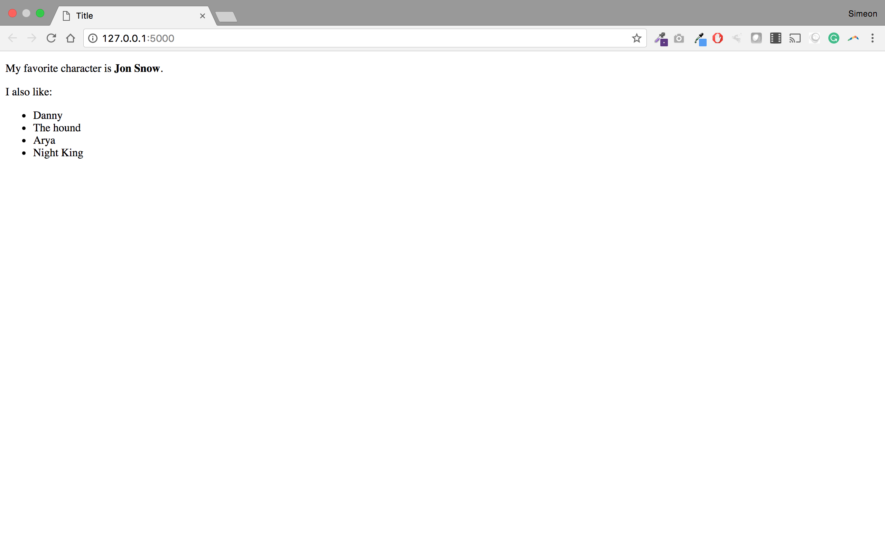

# Lesson 2 - Hello world with template

## Learning Objectives
* Learn how to use html templates with Flask

## The Walkthrough
1. Create a Flask Application
	* Name it FlaskApp_01

2. Edit the main python file (FlaskApp_01.py)
	* Make it look like the following

```python
from flask import Flask

app = Flask(__name__)

@app.route('/')
def hello_world():
    name = "Jon Snow"
    return render_template("index.html, name=name) 

if __name__ == '__main__':
    app.run()
```

3. Create an index page
	* In the template folder, create an index.html file
	* Make it look like the following

```html
<!DOCTYPE html>
<html lang="en">
<head>
    <meta charset="UTF-8">
    <title>Title</title>
</head>
<body>
    <strong>Hello, my name is {{ name }}</b></strong>
</body>
</html>
```

If it is done properly, when you run your application, you will be able to navigate to localhost:5000 and see this:


## What is Going On