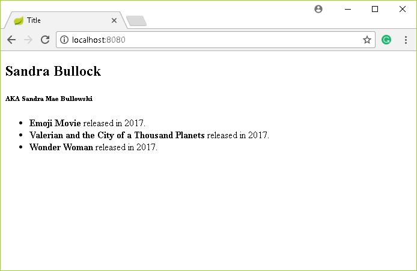

# Lesson 13 - Using Database Relationships with Spring Boot - ManyToMany
## The Walkthrough

1. Create a Spring Boot Application
	* Name it SpringBoot_13
	* Add the dependencies for the web, jpa, h2 and thymeleaf
	* Hit next until you finish the wizard, and then wait until it's done.    

2. Create a Class
	* Right click on com.example.demo and click New -> Class
	* Name it Movie.java
	* Edit it to look like this:

```java
import javax.persistence.*;
import java.util.Set;

@Entity
public class Movie {
    @Id
    @GeneratedValue(strategy = GenerationType.AUTO)
    private long id;
    private String title;
    private long year;
    private String description;

    @ManyToMany
    @JoinTable(
            name="movie_actor",
            joinColumns=@JoinColumn(name="MOVIE_ID", referencedColumnName = "ID"),
            inverseJoinColumns = @JoinColumn(name="ACTOR_ID", referencedColumnName = "ID"))
    private Set<Actor> cast;
    
    public void addActor(Actor actor)
    {
        cast.add(actor);
    }
}
```

3. Autogenerate getters and setters
	* Right-click on the word Movie and select generate -> Getters and Setters
	* Select all the fields listed and click OK

4. Create a Class
	* Right click on com.example.demo and click New -> Class
	* Name it Actor.java
	* Edit it to look like this:

```java
import javax.persistence.*;
import java.util.Set;

@Entity
public class Actor {
    @Id
    @GeneratedValue(strategy = GenerationType.AUTO)
    private long id;
    private String name;
    private String realname;

    @ManyToMany(mappedBy = "cast")
    private Set<Movie> movies;
}
```

5. Autogenerate getters and setters
	* Right-click on the word Actor and select generate -> Getters and Setters
	* Select all the fields listed and click OK

6. Create a Repository
	* Right click on com.example.demo and click New -> Class
	* Change the value of the drop-down box to Interface
	* Name it MovieRepository.java
	* Edit it to look like this:

```java
import org.springframework.data.repository.CrudRepository;

public interface MovieRepository extends CrudRepository<Movie, Long>{
}
```

7. Create a Repository
	* Right click on com.example.demo and click New -> Class
	* Change the value of the drop-down box to Interface
	* Name it ActorRepository.java
	* Edit it to look like this:
```java
import org.springframework.data.repository.CrudRepository;

public interface ActorRepository extends CrudRepository<Actor, Long>{
}


8. Create a Controller
	* Right click on com.example.demo and click New -> Class
	* Name it HomeController.java
	* Edit it to look like this:

``` java
package com.example.demo.controllers;

import com.example.demo.models.Actor;
import com.example.demo.models.Movie;
import com.example.demo.repositories.ActorRepository;
import com.example.demo.repositories.MovieRepository;
import org.springframework.beans.factory.annotation.Autowired;
import org.springframework.stereotype.Controller;
import org.springframework.ui.Model;
import org.springframework.web.bind.annotation.RequestMapping;

@Controller
public class HomeController {

    @Autowired
    ActorRepository actorRepository;

    @Autowired
    MovieRepository movieRepository;

    @RequestMapping("/")
    public String index(Model model){

        Actor a = new Actor();
        a.setName("Sandra Bullock");
        a.setRealname("Sandra Mae Bullowski");
        actorRepository.save(a);

        Movie movie = new Movie();
        movie.setTitle("Emoji Movie");
        movie.setYear(2017);
        movie.setDescription("About Emojis...");

        movie.addActor(a);

        movieRepository.save(movie);

        model.addAttribute("actors", actorRepository.findAll());
        return "index";
    }
    public void addMovie(Movie actor)
    {
        movies.add(actor);
    }
}

```

9. Create a Template
  * Right click on templates and click New -> Html
	* Name it index.html
	* Edit it to look like this:

```html
<!DOCTYPE html>
<html lang="en" xmlns:th="www.thymeleaf.org">
<head>
    <meta charset="UTF-8" />
    <title>Title</title>
</head>
<body>
<div th:each="actor : ${actors}">
    <h2 th:text="${actor.name}"></h2>
    <h6 th:inline="text">AKA [[${actor.realname}]]</h6>
<ul>
    <th:block  th:each="movie : ${actor.movies}">
    <li th:inline="text"><b>[[${movie.title}]]</b> released in [[${movie.year}]].</li>
    </th:block>
</ul>
</div>
</body>
</html>
```

10. Run your application and open a browser, if you type in the URL http://localhost:8080 you should see something like this:



### What's Going On?

Our application is tracking actors and movies. Each actor can be in **many** movies. And each movie can contain **many** actors. So the relationship between actors and movies in the database is described as Many to Many.

How does a database keep track of which actors go with which movies? We can't add a movie id to the actor table because that would allow only one movie per actor. We can't add an actor id field to the movie table because then there would only be room for one actor in every movie.

The solution? Use annotations to tell Spring Boot what we want.

There's not much we actually have to do because Spring Boot will handle the situation for us using annotations. Annotations are instructions to Spring Boot letting it know what our intentions are. Spring Boot will read the annotations and create the appropriate code and tables. Create a table that contains only actor ids and movie ids. Then we could have as many actor/movie combinations as we desired. We should add a limitation that the movie id and actor id combination can only be in the table once but we'll let the database deal with that. This table is defined in the Movie class using the ```@JoinTable``` annotation. The parameters of the annotation are used to create the movie_actor join table.

Look in the Actor class. Notice the annotation ```@ManyToMany(mappedBy = "cast")```? This annotation points back to the Movie class. The Movie class contains a data member for cast of type ```Set<Actor>```. This links the two together.

When the database is created it will contain three tables: movie, actor and movie_actor. And all our data will be properly related. And the only thing you did is set some values in annotations. Pretty cool, right?
