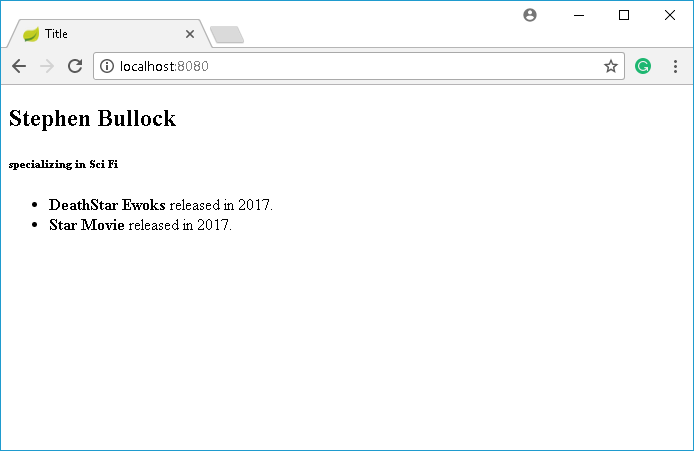

# Lesson 14 - Using Database Relationships with Spring Boot - OneToMany
## The Walkthrough

1. Create a Spring Boot Application
	* Name it SpringBoot_14
	* Add the dependencies for the web, jpa, h2 and thymeleaf
	* Hit next until you finish the wizard, and then wait until it's done.    

2. Create a Class
	* Right click on com.example.demo and click New -> Class
	* Name it Director.java
	* Edit it to look like this:
```java
@Entity
public class Director {
    @Id
    @GeneratedValue(strategy = GenerationType.AUTO)
    private long id;
    private String name;
    private String genre;

    @OneToMany(mappedBy = "director", cascade = CascadeType.ALL, fetch = FetchType.EAGER)
    public Set<Movie> movies;
}
```

3. Autogenerate getters and setters
	* Right-click on the word Director and select generate -> Getters and Setters
	* Select all the fields listed and click OK

4. Create a Class
	* Right click on com.example.demo and click New -> Class
	* Name it Movie.java
	* Edit it to look like this:
```java
@Entity
public class Movie {
    @Id
    @GeneratedValue(strategy = GenerationType.AUTO)
    private long id;
    private String title;
    private long year;
    private String description;

    @ManyToOne(fetch = FetchType.EAGER)
    @JoinColumn(name = "director_id")
    private Director director;
}
```

5. Autogenerate getters and setters
	* Right-click on the word Movie and select generate -> Getters and Setters
	* Select all the fields listed and click OK

6. Create a Repository
	* Right click on com.example.demo and click New -> Class
	* Name it MovieRepository.java
	* Edit it to look like this:
```java
import org.springframework.data.repository.CrudRepository;

public interface MovieRepository extends CrudRepository<Movie, Long>{
}
```

7. Create a Repository
	* Right click on com.example.demo and click New -> Class
	* Name it DirectorRepository.java
	* Edit it to look like this:
```java
import org.springframework.data.repository.CrudRepository;

public interface DirectorRepository extends CrudRepository<Director, Long>{
}
```

8. Create a Controller
	* Right click on com.example.demo and click New -> Class
	* Name it HomeController.java
	* Edit it to look like this:
``` java
import org.springframework.beans.factory.annotation.Autowired;
import org.springframework.stereotype.Controller;
import org.springframework.ui.Model;
import org.springframework.web.bind.annotation.RequestMapping;
import java.util.HashSet;
import java.util.Set;

@Controller
public class HomeController {

    @Autowired
    DirectorRepository directorRepository;

    @RequestMapping("/")
    public String index(Model model){
        // First let's create a director
        Director director = new Director();
        director.setName("Stephen Bullock");
        director.setGenre("Sci Fi");

        // Now let's create a movie
        Movie movie = new Movie();
        movie.setTitle("Star Movie");
        movie.setYear(2017);
        movie.setDescription("About Stars...");

        // Add the movie to an empty list
        Set<Movie> movies = new HashSet<Movie>();
        movies.add(movie);

        movie = new Movie();
        movie.setTitle("DeathStar Ewoks");
        movie.setYear(2011);
        movie.setDescription("About Ewoks on the DeathStar...");
        movies.add(movie);

        // Add the list of movies to the director's movie list
        director.setMovies(movies);

        // Save the director to the database
        directorRepository.save(director);

        // Grad all the directors from the database and send them to
        // the template
        model.addAttribute("directors", directorRepository.findAll());
        return "index";
    }
}
```

9. Create a Template
  	* Right click on templates and click New -> Html
	* Name it index.html
	* Edit it to look like this:
```html
<!DOCTYPE html>
<html lang="en" xmlns:th="www.thymeleaf.org">
<head>
    <meta charset="UTF-8" />
    <title>Title</title>
</head>
<body>
<div th:each="director : ${directors}">
    <h2 th:text="${director.name}"></h2>
    <h6 th:inline="text">specializing in [[${director.genre}]]</h6>
    <ul>
        <th:block  th:each="movie : ${director.movies}">
            <li th:inline="text"><b>[[${movie.title}]]</b> released in [[${movie.year}]].</li>
        </th:block>
    </ul>
</div>
</body>
</html>
```

10. Run your application and open a browser, if you type in the URL http://localhost:8080 you should see something like this:



### What's Going On?

Our application is tracking directors and movies. Each director can direct **many** movies. And each movie can have only **one** director. So the relationship between actors and movies in the database is described as One to Many. (The way I've written it you could say it's many to one but nobody refers to it that way so bear with me).

How does a database keep track of which movies go with which directors? We can add a director id to the movie table. This will work because we have decided there would be only one director per movie.

The solution? As before, use annotations to configure our application. They tell Spring Boot how to set up the database. Let Spring Boot work out the underlying details.

In the director class we create an annotation for OneToMany and we attach that (by placing it above) to a set of movies. Now each director comes with their own collection of movies.

Why a set? Why not an array list or hash table? A set is a special object in Java. It allows each element to exist only once. So if you tried to add the same movie eighty-billion times you'd still only have one instance of it in the set. The annoyed set would just keep ignoring you. Another thing about the set... order doesn't matter. A list generally implies order. A set just contains items.

What is mappedBy? It tells the set of movies where to save the data. In other words, the director class is the keeper of the movie set. So, add a mappedBy="director" attribute to your Director class to signal to the persistence provider that the join column should be in the Director table.

What is cascade?
The meaning of CascadeType.ALL is that the persistence will propagate (cascade) **all** EntityManager operations (PERSIST, REMOVE, REFRESH, MERGE, DETACH) to the relating entities.

When defining relationships between objects you should identify the class that will serve as the owner of the relationship or keeper of the data. You should specify the ```@JoinColumn``` annotation in the class that owns the relationship.
