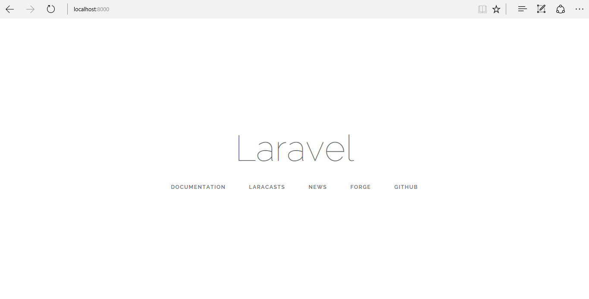

<!-- enter lesson number and title below separated by hyphen-->
# Lesson-01 Hello World!
## Learning Objectives
You are going to create a "Hello World" application in Laravel.

## The Walkthrough
1. Create a new application:

In this case, you will type the following in your terminal, shell or command prompt:

``` shell 
laravel new Lesson01
```

A new application will be created for you.

2. Generate your application key, by typing:

``` shell
php artisan key:generate
```

3. Create a Template:

Laravel already has pages set up, so you can modify these. Later on, you will also see how to create your own files and serve them.

* Open welcome.blade.php. You will find it in the resources/views folder.
Edit it to look like this:

``` html
<!DOCTYPE html>
<html lang="en">
<head>
    <meta charset="UTF-8" />
    <title>Title</title>
</head>
<body>
    <h2>Hello World!</h2>
</body>
</html>
```

3. Run your application:

```
php artisan serve
```

4. Open a browser.
If you type in the URL http://localhost:8000 you should see this:


5. Run your application and open a browser, if you type in the URL http://localhost:8000 you should see this:


## What is Going On
Your application is being 'scaffolded' when you type 'laravel new [application_name]'. That means that all of the basic classes that you will need to use are being added to your laravel project, and it is being set up for you. The 'bare-bones' application you download is like a template, and has most of the classes you will need to develop a functional application. You will use composer for dependency management, so if you want to use a class that is not available as part of the basic bundle, you will need to use composer to install it.

Your application uses a template engine called Blade to render php objects in HTML. By default, blade templates are stored in the ***resources/views*** folder, and are named **[Your_File_Name].blade.php**. This way, your application can recognise blade statements and variables. Blade renders into PHP. The blade template looks like HTML5, but it uses Blade's curly braces {{}} to render objects, and @ to render statements.
