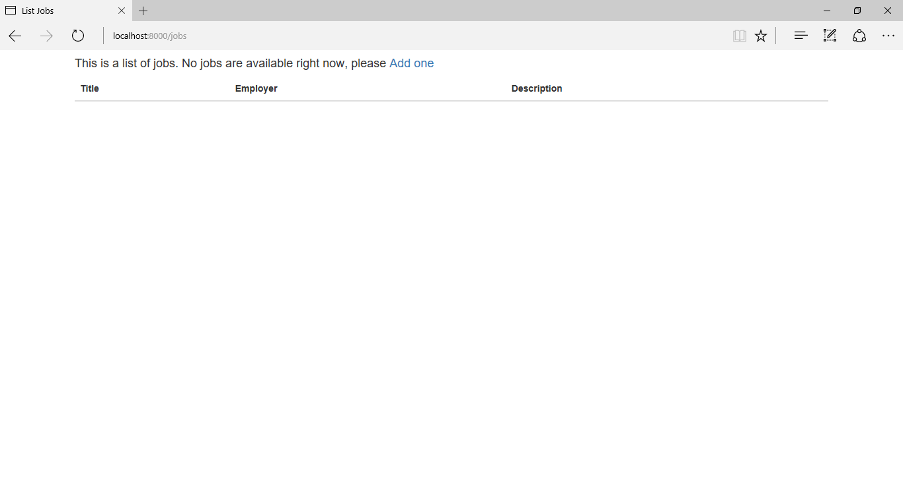

# Lesson-06 Looping through items with Blade

## Learning Objectives
* How to loop through data in Blade
* How to use Controllers for model specific operations

## The Walkthrough

1. Create a new Laravel project caled Lesson06.

2. Create a database called jobdb

3. Use Lesson 04 to set up your database configuration in your new project.

4. Create a job model and a migration to create the jobs table.
(ALWAYS make sure you have your database running in the background!)

```
php artisan make:model Job -m
```
You should now have the following files in your project:
* **create_jobs_table.php** in the /database/migrations folder
* **Job.php** in the app folder  

5. Create a JobController
```
php artisan make:controller JobController --resource --model=Job

```
6. Create the fields that will be used in the jobs table:

* Edit the create_jobs_table.php file in \daabase\migrations to look like this:
```
<?php

use Illuminate\Support\Facades\Schema;
use Illuminate\Database\Schema\Blueprint;
use Illuminate\Database\Migrations\Migration;

class CreateJobsTable extends Migration
{
    /**
     * Run the migrations.
     *
     * @return void
     */
    public function up()
    {
        Schema::create('jobs', function (Blueprint $table) {
            $table->increments('id');
            $table->char('title');
            $table->char('employer');
            $table->char('description');
            $table->timestamps();
        });
    }

    /**
     * Reverse the migrations.
     *
     * @return void
     */
    public function down()
    {
        Schema::dropIfExists('jobs');
    }
}

```

Then create the table with the migration command:
```
php artisan migrate
```


7. Open the JobController.php file,located in app\Http\Controllers

Make sure you have an index function in the JobController file that looks like this:

``` php
public function index()
   {
       return view('jobs.index',['jobs'=>Job::all()]);
   }
```

8. Create a route to get a list of jobs and pass that list to a view:
* Open the web.php file, and include the following route:
Route::resource('jobs','JobController');

9. Create a route in the JobController that allows the user to input job details:
* Open app\Http\Controllers\JobController.php
* Edit it to look like this:
``` php
public function create()
    {
        //
        return view('jobs.create');
    }
```

10. Create a view to display the input form:
Create a file called resources\views\jobs\create.blade.php, and edit it to look like this:

``` html

<!DOCTYPE html>
<html lang="en">
    <head>
        <meta charset ="UTF8">
            <title>Job Input</title>
          <link rel="stylesheet" href="http://maxcdn.bootstrapcdn.com/bootstrap/3.3.7/css/bootstrap.min.css" integrity="sha384-BVYiiSIFeK1dGmJRAkycuHAHRg32OmUcww7on3RYdg4Va+PmSTsz/K68vbdEjh4u" crossorigin="anonymous"/>

</head>
<body>
    <div class="container">
        <div class="col-md-10">
            <form action="/jobs" method="post">

                @if ($errors->any())
                    <div class="alert alert-danger">
                        <ul>
                            @foreach ($errors->all() as $error)
                                <li>{{ $error }}</li>
                            @endforeach
                        </ul>
                    </div>
                @endif
                
                Title:<input class="form-control" type="text" name="title">
                Employer:<input class="form-control" type="text" name="employer">
                Description:<input class="form-control" type="textarea" name="description">
                {{csrf_field()}}
                <br/>
                <input class="btn btn-success"type="submit" value="Submit"></a>
            </form>
        </div>
    </div>
</body>
</html>
```

11. Create a file called resources\views\jobs\index.blade.php, and edit it to look like this:

``` html
<!DOCTYPE html>

<html lang="en" xmlns:th="www.thymeleaf.org">
<head>
    <meta charset="UTF-8" />
    <title>List Jobs</title>

    <link rel="stylesheet" href="http://maxcdn.bootstrapcdn.com/bootstrap/3.3.7/css/bootstrap.min.css" integrity="sha384-BVYiiSIFeK1dGmJRAkycuHAHRg32OmUcww7on3RYdg4Va+PmSTsz/K68vbdEjh4u" crossorigin="anonymous"/>
</head>
<body>
<div class="container">
        <table class="table table-striped">
            <thead>
                @if(count($jobs))
                 <h4><a class="pull-right" href="/jobs/create">Add a job </a> </h4>
                @endif
                    <tr>
                        <th>Title</th>
                        <th>Employer</th>
                        <th>Description</th>
                        </tr>
            </thead>
            <tbody>

                @forelse($jobs as $job)
                    <tr>
                        <td>{{$job->title}}</td>
                        <td>{{$job->employer}}</td>
                        <td>{{$job->description}}</td>
                    </tr>
                @empty
                    <h4> This is a list of jobs. No jobs are available right now, please <a href="/jobs/create">Add one </a> </h4>
                @endforelse
            </tbody>
</table>
</div>
</body>
</html>


```


12. Modify the **store** function JobController to make it save new entries:

``` php 
 public function store(Request $request)
    {

        //The assignment has to be done manually 

         $rules = array('title'=>'required|min:4',
         'employer'=>'required|min:3','description'=>'min:4');
         $request->validate($rules);
        $j = new Job;
        $j->employer = $request->employer;
        $j->title=$request->title;
        $j->description=$request->description;
        $j->save();

        //Get the number of records in the table and pass it to the view  

        return view('jobs.index')->with(['jobs'=>Job::all()]);

    }

```


13. Run your application and ope a browser. 
If you type in the url http://localhost:8080/jobs, you should see this: 



# What's going on:

#### Creating a job and model:
These can be done at the same time by typing the text above.

#### Creating a resourceful JobController
This is for job related actions. We are going to make a resource controller so that http verbs (GET, PUT, POST, DELETE) can automatically be called.
