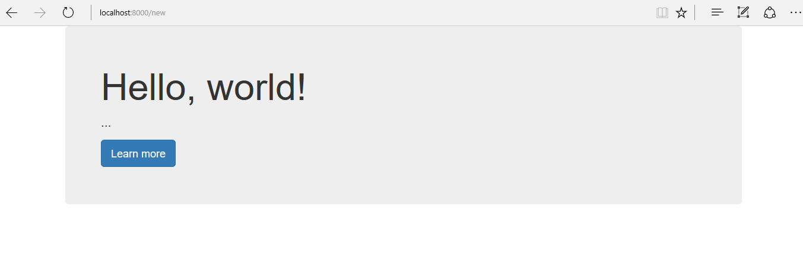

<!-- enter lesson number and title below separated by hyphen-->
# Lesson-07 Adding Twitter Bootstrap to Laravel
#### (The easy way)

## Learning Objectives
You will learn how to include a bootstrap (or any link that can be included with a URL) in your template.

In this example, we will include links from the Twitter Bootstrap Content Distribution Network (CDN). This will allow you to use styles from the Twitter Bootstrap library in your application.

## The Walkthrough
1. Create a Laravel Application named Laravel07

2. Create a route for your new welcome page at /new:
* Open the web.php file in the /routes folder
Type the following:
``` php

Route::get('/new',function(){
     return view('otherwelcome');
  });
```

3. Create a Template
Create a file called otherwelcome.blade.php in Lesson07/resources/views
Edit it to look like this:

``` html
<!DOCTYPE html>
<html lang="en">
<head>
    <meta charset="utf-8" />
    <meta http-equiv="X-UA-Compatible" content="IE=edge" />
    <meta name="viewport" content="width=device-width, initial-scale=1" />
    <title>Bootstrap 101 Template</title>

</head>
<body>
    <div class="container">
        <div class="jumbotron">
            <h1>Hello, world!</h1>
            <p>...</p>
            <p><a class="btn btn-primary btn-lg" href="#" role="button">Learn more</a></p>
        </div>
    </div>
<script src="https://ajax.googleapis.com/ajax/libs/jquery/1.12.4/jquery.min.js"></script>

</body>
</html>
```

* Go to http://getbootstrap.com/getting-started and copy the Bootstrap CDN links
* Paste that code right above the </head> tag

3. Run your application:   
``` shell
 php artisan serve
 ```

 4. Navigate to http://localhost:8000/new in your browser.
You should see this:



## What's Going On
