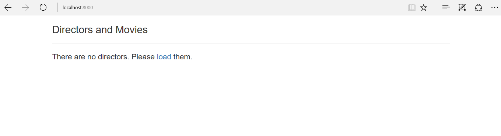
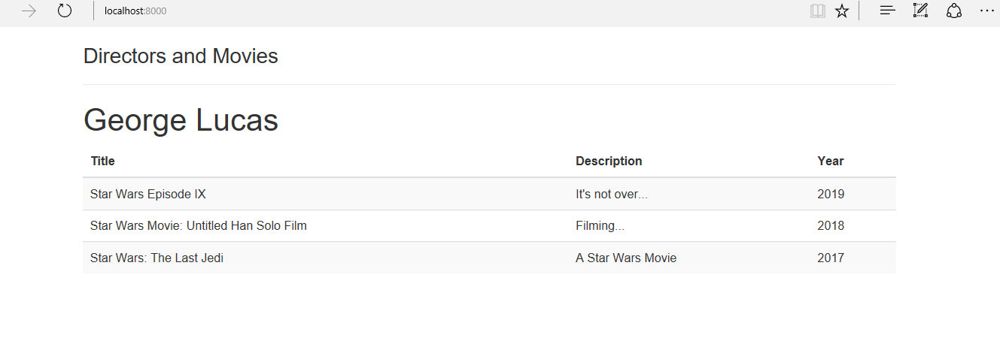
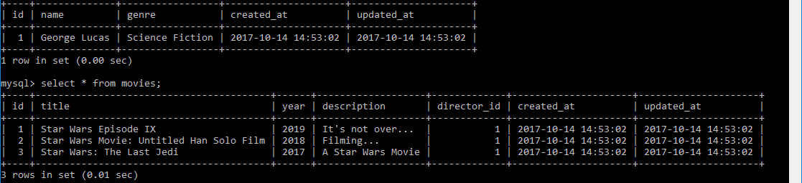

<!-- enter lesson number and title below separated by hyphen-->
# Lesson-Using Database Relationships 
#### One to Many Relationships 

## Learning Objectives

## The Walkthrough

1. Create a new Laravel application named Lesson11 and configure a connection to the database 


2. Create a Director model with a resource controller and a migration: 

``` shell 

php artisan make:model Director -mc --resource
```

3. Create a Movie model with a resource controller and a migration: 
``` shell 
php artisan make:model Movie -mc --resource 
``` 

4. Modify the migrations to include the fields in each table: 

* First the directors migration:
``` php 

<?php

use Illuminate\Support\Facades\Schema;
use Illuminate\Database\Schema\Blueprint;
use Illuminate\Database\Migrations\Migration;

class CreateDirectorsTable extends Migration
{
    /**
     * Run the migrations.
     *
     * @return void
     */
    public function up()
    {
        Schema::create('directors', function (Blueprint $table) {
            $table->increments('id');
            $table->char('name');
            $table->char('genre');
            $table->timestamps();
        });
    }

    /**
     * Reverse the migrations.
     *
     * @return void
     */
    public function down()
    {
        Schema::dropIfExists('directors');
    }
}

```

* Next, the movies migration: 

``` php 
<?php

use Illuminate\Support\Facades\Schema;
use Illuminate\Database\Schema\Blueprint;
use Illuminate\Database\Migrations\Migration;

class CreateMoviesTable extends Migration
{
    /**
     * Run the migrations.
     *
     * @return void
     */
    public function up()
    {
        Schema::create('movies', function (Blueprint $table) {
            $table->increments('id');
            $table->char('title');
            $table->char('year');
            $table->char('description');
            $table->integer('director_id');
            $table->foreign('director_id')
            ->references('id')->on('directors')
            ->onDelete('cascade');
            $table->timestamps();
        });
    }

    /**
     * Reverse the migrations.
     *
     * @return void
     */
    public function down()
    {
        Schema::dropIfExists('movies');
    }
}

```


5. Modify the Director model to define the relationship between directors and movies: 

``` php 
<?php

namespace App;

use Illuminate\Database\Eloquent\Model;

class Director extends Model
{
 

    public function movies()
    {
    	$this->hasMany('App\Movie');
    }
}


```

6. Modify the Movie modelto define the relationship between movies and directors: 

``` php 

<?php

namespace App;

use Illuminate\Database\Eloquent\Model;

class Movie extends Model
{
    //

    public function directors()
    {
    	return $this->belongsTo('App\Director');
    }
}

```


6. Run all migrations to create required tables in the database 
``` shell 
php artisan migrate
```

7. Create a form to show the director and movie information: 

``` php
<!DOCTYPE html>

<html lang="en" xmlns:th="www.thymeleaf.org">
<head>
    <meta charset="UTF-8" />
    <title>List Jobs</title>

    <link rel="stylesheet" href="http://maxcdn.bootstrapcdn.com/bootstrap/3.3.7/css/bootstrap.min.css" integrity="sha384-BVYiiSIFeK1dGmJRAkycuHAHRg32OmUcww7on3RYdg4Va+PmSTsz/K68vbdEjh4u" crossorigin="anonymous"/>
</head>
<body>
<div class="container">

<h3>Directors and Movies</h3>
<hr/>

@forelse($directors as $director)

<h1>{{$director->name}}</h1>
		<table class="table table-striped">
			<thead>
					<tr>
						<th>Title</th>
						<th>Description</th>
						<th>Year</th>
						</tr>
			</thead>
			<tbody>
				@forelse($director->movies as $movie)
					<tr>
						<td>{{$movie->title}}</td>
						<td>{{$movie->description}}</td>
						<td>{{$movie->year}}</td>
					</tr>
				@empty
					<h4>This director has no movies </a> </h4>
				@endforelse
			</tbody>
</table>
@empty 
<h4>There are no directors. Please <a href="/load">load</a> them. </h4>
@endforelse 
</div>
</body>
</html>
```


8. Create route for associating directors with movies: 
* Edit web.php in the routes folder. Add the following code: 

``` php

<?php

/*
|--------------------------------------------------------------------------
| Web Routes
|--------------------------------------------------------------------------
|
| Here is where you can register web routes for your application. These
| routes are loaded by the RouteServiceProvider within a group which
| contains the "web" middleware group. Now create something great!
|
*/
use App\Director;
use App\Movie;

Route::get('/', function () {
    return view('listmovies');
});

Route::get('/load',function(){

	
	//Create a director 
	$director = new App\Director;
	$director->name="George Lucas";
	$director->genre="Science Fiction";
	$director->save();


	//Create several movies tied to the director created 
	$movie = new App\Movie;  
	$movie->title="Star Wars Episode IX";
	$movie->description="It's not over...";
	$movie->year=2019;  
	$director->movies()->save($movie);


	$movie = new App\Movie;  
	$movie->title="Star Wars Movie: Untitled Han Solo Film";
	$movie->description="Filming...";
	$movie->year=2018;  
	$director->movies()->save($movie);


	$movie = new App\Movie;  
	$movie->title="Star Wars: The Last Jedi";
	$movie->description="A Star Wars Movie";
	$movie->year=2017;  
	$director->movies()->save($movie);

	//Retuns to the main page 
	return redirect('/');
});


``` 

9. Run your application and navigate to port 8000 on your localhost. 

You should see this:


Click on the link, and your data will be loaded. 


You should now see this: 



10. Examine the database: 

* Use the database you created for this project: 
``` shell

use [databasename];

```

* Show all the data in the directors table: 
``` shell 

select * from directors; 
``` 

* Show all the data in the movies table: 
``` shell 

select * from movies; 
```

You should see something like this:




## What is Going On
