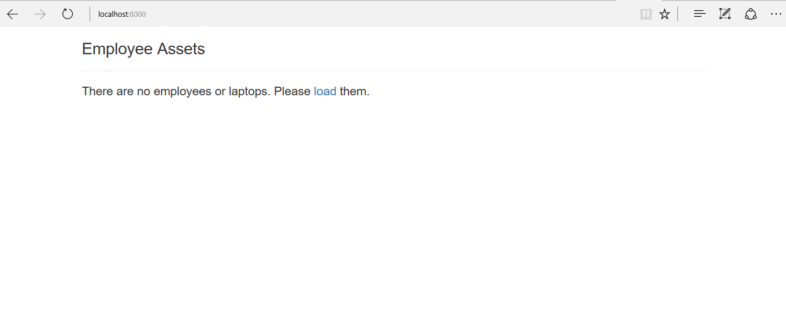

<!-- enter lesson number and title below separated by hyphen-->
# Lesson-12: Using Database Relationships: One to One  

## Learning Objectives

## The Walkthrough

1. Create a new Laravel application named Lesson12 and configure a connection to the database. Refer to Lesson04 for this. 

2. Create models and resource controllers for Employee and Laptop: 

* First for Employee: 
``` shell 
php artisan make:model Employee -mc --resource 
```

* Then for Laptop:

``` shell 
php artisan make:model Laptop -mc --resource 
```

3. Modify the Employee migration, so that it includes the fields required an ID for the laptop that the employee owns: 
``` php 
<?php

use Illuminate\Support\Facades\Schema;
use Illuminate\Database\Schema\Blueprint;
use Illuminate\Database\Migrations\Migration;

class CreateEmployeesTable extends Migration
{
    /**
     * Run the migrations.
     *
     * @return void
     */
    public function up()
    {
        Schema::create('employees', function (Blueprint $table) {
            $table->increments('id');
            $table->char('name');
            $table->char('ssn');
            $table->char('laptop_id')->nullable();
            $table->timestamps();
        });
    }

    /**
     * Reverse the migrations.
     *
     * @return void
     */
    public function down()
    {
        Schema::dropIfExists('employees');
    }
}

```

4. Modify the Laptop migration so that it includes the necessary fields:

``` php 
<?php

use Illuminate\Support\Facades\Schema;
use Illuminate\Database\Schema\Blueprint;
use Illuminate\Database\Migrations\Migration;

class CreateLaptopsTable extends Migration
{
    /**
     * Run the migrations.
     *
     * @return void
     */
    public function up()
    {
        Schema::create('laptops', function (Blueprint $table) {
            $table->increments('id');
            $table->char('brand');
            $table->char('model');
            $table->timestamps();
        });
    }

    /**
     * Reverse the migrations.
     *
     * @return void
     */
    public function down()
    {
        Schema::dropIfExists('laptops');
    }
}


```

5. Modify the Employee model so that it relects the one to one relationship: 
Use the field that identifies the laptop being owned in the employee table

``` php 
<?php

namespace App;

use Illuminate\Database\Eloquent\Model;

class Employee extends Model
{
     public function laptops()
     {
     	return $this->hasOne('App\Laptop', 'employee_id');
     }
     
}


```


6. Modify the Laptop model so that it reflects the one to one relationship where the laptop is owned by a single employee:
``` php 
<?php

namespace App;

use Illuminate\Database\Eloquent\Model;

class Laptop extends Model
{
    public function employees()
    {
    	return $this->belongsTo('App\Employee');
    }
}
```

6. Create a route for creating and saving the data: 

7. Create a page named index.blade.php in the resources/views folder to view the data. Edit it to look like this:

```php 

	<!DOCTYPE html>

	<html lang="en" xmlns:th="www.thymeleaf.org">
	<head>
	    <meta charset="UTF-8" />
	    <title>List Assets</title>

	    <link rel="stylesheet" href="http://maxcdn.bootstrapcdn.com/bootstrap/3.3.7/css/bootstrap.min.css" integrity="sha384-BVYiiSIFeK1dGmJRAkycuHAHRg32OmUcww7on3RYdg4Va+PmSTsz/K68vbdEjh4u" crossorigin="anonymous"/>
	</head>
	<body>
	<div class="container">

	<h3>Employee Assets</h3>
	<hr/>

	@forelse($employees as $employee)
		<h4>{{$employee->name}}</h4>
		<h5>identified by {{$employee->ssn}}</h5>
		<h5>has been assigned a {{$employee->laptops->brand}} {{$employee->laptops->model}}</h5>
	@empty 

	<h4>There are no employees or laptops. Please <a href="/load">load</a> them. </h4>
	@endforelse 
	</div>
	</body>
	</html>
```

7. Run your application and navigate to port 8000 in the browser. 

You should see this:



Once the data is loaded, you should see this:


8. Examine the database. 

Show all the data from the employees table: 
``` shell 
select * from employees; 

Show all the data from the laptops table:
``` shell 

select * from laptops; 
``` 

Your data should look like this:


## What is Going On
